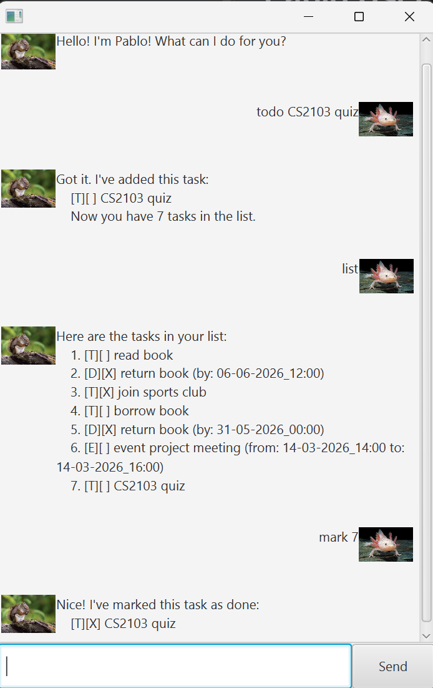

# Pablo User Guide



Pablo is a text-based chatbot to help track your tasks! Each task can be marked as completed/incomplete for more convenient tracking. It currently supports 3 different types of tasks as follows:

- ToDo tasks (Tasks without a specific timing attached)
- Deadline tasks (Tasks that need to be completed by a certain deadline)
- Event tasks (Tasks with a start and end date/time)

The currently supported features include:

- [Adding ToDo](#adding-deadlines)
- [Adding Deadlines](#adding-deadlines)
- [Adding Events](#adding-events)
- [Deleting Tasks](#deleting-tasks)
- [Listing Tasks](#listing-tasks)
- [Marking/Unmarking Tasks](#markingunmarking-tasks)
- [Finding Tasks](#finding-tasks)
- [Exiting Pablo](#exiting-pablo)

### Adding ToDos

Adds a ToDo task to the task list.

Command:
```
todo <task_name>
```

Example: `todo read book`


### Adding Deadlines

Adds a Deadline task to the task list.

Command:
```
deadline <task_name> /by <deadline_datetime>
```

Note: `<deadline_datetime>` must be formatted as `dd-mm-yyyy_hh:mm`.

Example: `deadline CS2103 quiz /by 13-02-2026_12:00`

### Adding Events

Adds an Event task to the task list.

Command:
```
event <task_name> /from <start_datetime> /to <end_datetime>
```

Note: `<start_datetime>` and `<end_datetime>` must be formatted as `dd-mm-yyyy_hh:mm`.

Example: `event movie /from 13-02-2026_18:00 /to 13-02-2026_20:00`

### Deleting Tasks

Deletes the task at the specified index.

Command:
```
delete <index>
```

Example: `delete 2`

### Listing Tasks

Lists all tasks in the task list currently.

Command:
```
list
```

### Marking/Unmarking Tasks

Marks/Unmarks a task as completed.

Command:
```
mark <index>
unmark <index>
```

Example: `mark 2`, `unmark 1`

### Finding Tasks

Finds all tasks which contains a keyword and lists them.

Command:
```
find <keyword>
```

Example: `find book`

### Exiting Pablo

Exits the chatbot.

Command:
```
bye
```